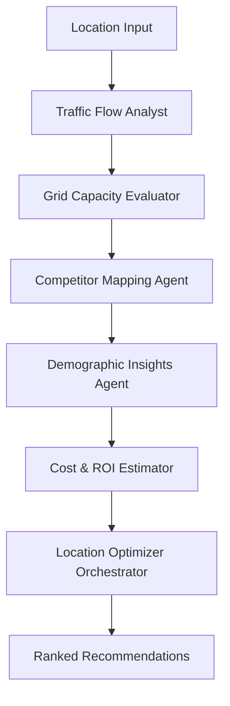

# Smart EV Charging Network Optimizer for Tamil Nadu

> **AI-Powered Location Intelligence for Electric Vehicle Charging Infrastructure**

A comprehensive solution that uses multiple specialized AI agents to optimize EV charging station locations in Tamil Nadu, India. The system analyzes traffic patterns, grid capacity, competition, demographics, and ROI to provide data-driven recommendations.

---

## **Problem Statement**

### **Current Challenges in EV Infrastructure Planning:**

1. **Manual Decision Making** - EV companies struggle with manual, time-consuming location selection processes
2. **Complex Multi-Factor Analysis** - Need to consider traffic flow, electrical grid capacity, competitor presence, demographics, and financial viability simultaneously
3. **Lack of Real-Time Data Integration** - No unified system to fetch and analyze dynamic data from multiple sources
4. **Poor ROI Predictions** - Difficulty in accurately estimating return on investment for new charging stations
5. **Regional Expertise Gap** - Limited understanding of Tamil Nadu's specific infrastructure and demographic patterns

### **Business Impact:**
- **Suboptimal Locations** leading to underutilized charging stations
- **Revenue Loss** from poor site selection
- **Delayed Market Entry** due to lengthy analysis processes
- **Competitive Disadvantage** in the rapidly growing EV market

---

## **Solution Approach**

### **Multi-Agent AI System Architecture**

Our solution employs **6 specialized AI agents** orchestrated by **LangGraph** to automate the entire optimization process:



### **Key Innovation:**
- **Dynamic Data Fetching**: All data sourced from real-time APIs, no hardcoded datasets
- **Agent Specialization**: Each agent focuses on one domain for maximum accuracy
- **Intelligent Orchestration**: LangGraph manages complex workflows and dependencies
- **Scalable Architecture**: Easy to add new agents or modify existing analysis

---

## **Technology Stack**

### **Backend Architecture**
| Component | Technology | Purpose |
|-----------|------------|---------|
| **API Framework** | FastAPI 0.104.1 | High-performance REST API with automatic documentation |
| **Agent Orchestration** | LangGraph 0.0.65 | Workflow management for AI agent coordination |
| **AI/LLM** | Gemini 1.5 Flash | Natural language reasoning and insights generation |
| **Vector Database** | Weaviate 3.25.3 | Storing and querying location optimization data |
| **Dependency Management** | Poetry | Python package and virtual environment management |
| **Geospatial Processing** | Geopy, Overpy | Location geocoding and OpenStreetMap data processing |
| **HTTP Client** | HTTPX | Async HTTP requests to external APIs |
| **Data Processing** | Pandas, NumPy | Numerical analysis and data manipulation |

### **Frontend Architecture**
| Component | Technology | Purpose |
|-----------|------------|---------|
| **UI Framework** | React 18 | Component-based user interface |
| **Build Tool** | Vite 5.0 | Fast development and build tooling |
| **Styling** | Tailwind CSS 3.3 | Utility-first CSS framework |
| **Maps** | React Leaflet | Interactive mapping and visualization |
| **HTTP Client** | Axios | API communication |
| **Icons** | Lucide React | Beautiful, customizable icons |
| **Forms** | React Hook Form | Efficient form handling and validation |

### **Infrastructure & DevOps**
| Component | Technology | Purpose |
|-----------|------------|---------|
| **Containerization** | Docker & Docker Compose | Service orchestration and deployment |
| **Database** | Weaviate (Dockerized) | Vector storage for recommendations |

### **External Data Sources (Free APIs)**
- **OpenStreetMap/Overpass API**: Traffic and road network data
- **Nominatim**: Geographic location services
- **India Government Open Data**: Infrastructure and demographic information
- **Census APIs**: Population and economic statistics

---

## 📁**Complete Project Structure & File Responsibilities**

```
ev-charging-optimizer/
├── 📄 README.md                          # This comprehensive documentation
├── 📄 .gitignore                         # Git ignore rules for Python, Node.js, Docker
├── 📄 docker-compose.yml                 # Development environment orchestration
├── 📄 docker-compose.prod.yml            # Production deployment configuration
│
├── 🗂️ backend/                           # Python FastAPI Backend
│   ├── 📄 pyproject.toml                 # Poetry dependencies and project config
│   ├── 📄 poetry.lock                    # Locked dependency versions
│   ├── 📄 requirements.txt               # Alternative pip dependencies
│   ├── 📄 .env.example                   # Environment variables template
│   ├── 📄 .env                          # Actual environment variables (gitignored)
│   │
│   ├── 🗂️ app/                          # Main application package
│   │   ├── 📄 __init__.py                # Package initialization
│   │   ├── 📄 main.py                    # FastAPI app entry point & CORS setup
│   │   ├── 📄 config.py                  # Application settings & configuration
│   │   ├── 📄 models.py                  # Pydantic models & TypedDict for LangGraph
│   │   │
│   │   ├── 🗂️ agents/                   # AI Agent Implementations
│   │   │   ├── 📄 __init__.py            # Agents package initialization
│   │   │   ├── 📄 base_agent.py          # Abstract base class for all agents
│   │   │   ├── 📄 traffic_agent.py       # Traffic Flow Analysis (OpenStreetMap)
│   │   │   ├── 📄 grid_agent.py          # Electrical Grid Capacity Assessment
│   │   │   ├── 📄 competitor_agent.py    # Existing Charging Station Mapping
│   │   │   ├── 📄 demographic_agent.py   # Population & Economic Analysis
│   │   │   ├── 📄 roi_agent.py           # Cost & ROI Calculations
│   │   │   └── 📄 orchestrator_agent.py  # Final Recommendation Synthesis
│   │   │
│   │   ├── 🗂️ services/                 # External Service Integrations
│   │   │   ├── 📄 __init__.py            # Services package initialization
│   │   │   ├── 📄 weaviate_service.py    # Vector database operations
│   │   │   ├── 📄 api_service.py         # External API client wrapper
│   │   │   └── 📄 llm_service.py         # Gemini LLM integration
│   │   │
│   │   ├── 🗂️ workflows/                # LangGraph Workflow Orchestration
│   │   │   ├── 📄 __init__.py            # Workflows package initialization
│   │   │   └── 📄 optimization_workflow.py  # Main agent coordination workflow
│   │   │
│   │   ├── 🗂️ utils/                    # Utility Functions
│   │   │   ├── 📄 __init__.py            # Utils package initialization
│   │   │   ├── 📄 data_fetcher.py        # Generic data fetching utilities
│   │   │   └── 📄 geo_utils.py           # Geographic calculation helpers
│   │   │
│   │   └── 🗂️ routers/                  # FastAPI Route Handlers
│   │       ├── 📄 __init__.py            # Routers package initialization
│   │       ├── 📄 optimization.py       # Main optimization endpoint (POST /optimize)
│   │       └── 📄 health.py              # Health check endpoints
│
├── 🗂️ frontend/                         # React Frontend Application
│   ├── 📄 package.json                   # NPM dependencies and scripts
│   ├── 📄 package-lock.json              # Locked NPM dependency versions
│   ├── 📄 vite.config.js                 # Vite build configuration
│   ├── 📄 tailwind.config.js             # Tailwind CSS configuration
│   ├── 📄 postcss.config.js              # PostCSS configuration
│   ├── 📄 index.html                     # HTML entry point
│   ├── 📄 .env.example                   # Frontend environment template
│   ├── 📄 .env                          # Frontend environment variables
│   │
│   ├── 🗂️ src/                          # Source Code
│   │   ├── 📄 main.jsx                   # React application entry point
│   │   ├── 📄 App.jsx                    # Main application component with header/footer
│   │   ├── 📄 index.css                  # Global styles and Tailwind imports
│   │   │
│   │   ├── 🗂️ components/               # React Components
│   │   │   ├── 🗂️ Map/                  # Interactive Map Components
│   │   │   │   ├── 📄 MapView.jsx        # Main map container with Leaflet
│   │   │   │   └── 📄 LocationMarker.jsx # Custom markers for recommendations
│   │   │   │
│   │   │   ├── 🗂️ Dashboard/            # Main Dashboard Interface
│   │   │   │   ├── 📄 Dashboard.jsx      # Primary dashboard layout and logic
│   │   │   │   ├── 📄 MetricsCard.jsx    # Statistics display cards
│   │   │   │   └── 📄 RecommendationCard.jsx # Individual recommendation display
│   │   │   │
│   │   │   ├── 🗂️ Form/                 # Input Forms and Controls
│   │   │   │   ├── 📄 LocationForm.jsx   # Main location search form
│   │   │   │   └── 📄 FilterPanel.jsx    # Advanced filtering options
│   │   │   │
│   │   │   └── 🗂️ UI/                   # Reusable UI Components
│   │   │       ├── 📄 Button.jsx         # Styled button component
│   │   │       ├── 📄 Loading.jsx        # Loading spinner component
│   │   │       └── 📄 ErrorMessage.jsx   # Error display component
│   │   │
│   │   ├── 🗂️ services/                 # API and External Services
│   │   │   ├── 📄 api.js                 # Axios HTTP client with interceptors
│   │   │   └── 📄 constants.js           # API endpoints and configuration
│   │   │
│   │   ├── 🗂️ hooks/                    # Custom React Hooks
│   │   │   ├── 📄 useOptimization.js     # Optimization API state management
│   │   │   └── 📄 useGeolocation.js      # Browser geolocation utilities
│   │   │
│   │   └── 🗂️ utils/                    # Utility Functions
│   │       ├── 📄 formatters.js          # Data formatting (currency, numbers)
│   │       └── 📄 validators.js          # Input validation functions
│   │
│   └── 🗂️ public/                       # Static Assets
│       └── 📄 vite.svg                   # Vite logo
```

---

##  **AI Agent Architecture & Responsibilities**

### **1. Traffic Flow Analyst** (`traffic_agent.py`)
- **Purpose**: Analyzes traffic patterns and road network density
- **Data Sources**: OpenStreetMap Overpass API, Nominatim geocoding
- **Operations**:
  - Geocodes location to coordinates
  - Queries road networks in radius
  - Calculates traffic scores based on road hierarchy
  - Identifies high-traffic zones
- **Output**: Traffic score (0-10), daily traffic estimates, road density metrics

### **2. Grid Capacity Evaluator** (`grid_agent.py`)
- **Purpose**: Assesses electrical infrastructure and power availability
- **Data Sources**: Government electricity APIs (placeholder implementation)
- **Operations**:
  - Evaluates grid capacity and reliability
  - Checks for planned infrastructure upgrades
  - Calculates power availability scores
- **Output**: Grid score (0-10), capacity in MW, reliability assessment

### **3. Competitor Mapping Agent** (`competitor_agent.py`)
- **Purpose**: Maps existing charging infrastructure and market gaps
- **Data Sources**: OpenStreetMap charging station data
- **Operations**:
  - Finds existing charging stations in area
  - Calculates distance to nearest competitors
  - Assesses market saturation levels
- **Output**: Competition score (0-10), competitor locations, market opportunity

### **4. Demographic Insights Agent** (`demographic_agent.py`)
- **Purpose**: Analyzes population and economic factors
- **Data Sources**: Census APIs, demographic databases
- **Operations**:
  - Retrieves population density data
  - Analyzes income levels and EV adoption rates
  - Evaluates target market size
- **Output**: Demographic score (0-10), population metrics, adoption rates

### **5. Cost & ROI Estimator** (`roi_agent.py`)
- **Purpose**: Calculates financial viability and investment returns
- **Data Sources**: Cost models, revenue projections
- **Operations**:
  - Estimates installation and operational costs
  - Projects revenue based on usage patterns
  - Calculates payback periods and ROI
- **Output**: ROI score (0-10), financial projections, payback analysis

### **6. Location Optimizer Orchestrator** (`orchestrator_agent.py`)
- **Purpose**: Synthesizes all agent outputs into final recommendations
- **Operations**:
  - Applies weighted scoring algorithms
  - Generates AI-powered reasoning using Gemini LLM
  - Ranks locations by overall optimization score
- **Output**: Final ranked recommendations with confidence scores

---

## **How to Run the Application**

### **Prerequisites**
```bash
# System Requirements
- Python 3.11+ 
- Node.js 18+
- Git

# Check versions
python --version
node --version
```


#### **Backend Setup**
```bash
cd backend


python -m venv .venv

.\.venv\Scripts\Activate.ps1

# Install Poetry (if not installed)
poetry install

# Setup environment
cp .env.example .env
# Edit .env and add your GEMINI_API_KEY


# Start FastAPI server
poetry run uvicorn app.main:app --host 0.0.0.0 --port 8000 --reload
```

#### **Frontend Setup** (New Terminal)
```bash
cd frontend

# Install dependencies
npm install

# Setup environment
cp .env.example .env

# Start development server
npm run dev
```


---

## 🌐 **Application Access Points**

After startup, access these URLs:

| Service | URL | Purpose |
|---------|-----|---------|
| **Frontend UI** | http://localhost:5173 | Main application interface |
| **Backend API** | http://localhost:8000 | REST API endpoints |
| **API Documentation** | http://localhost:8000/docs | Interactive Swagger docs |
| **Weaviate Console** | http://localhost:8080 | Vector database interface |

---

## **API Endpoints & Operations**

### **Core Optimization Endpoint**
```bash
POST /api/v1/optimize/
```
**Request Body:**
```json
{
  "location": "Chennai, Tamil Nadu",
  "radius_km": 50,
  "budget": 5000000,
  "station_type": "fast",
  "max_recommendations": 5
}
```

**Response:**
```json
{
  "request_id": "uuid",
  "recommendations": [
    {
      "location": {
        "name": "Optimal Location near Chennai",
        "coordinates": {"latitude": 11.1271, "longitude": 78.6569},
        "address": "Strategic high-traffic area"
      },
      "scores": {
        "traffic_score": 8.5,
        "grid_capacity": 9.0,
        "competition_gap": 7.5,
        "demographics": 8.8,
        "roi_potential": 8.2,
        "overall_score": 8.4
      },
      "insights": {
        "daily_traffic": 45000,
        "estimated_monthly_revenue": 125000,
        "payback_period_months": 18
      }
    }
  ]
}
```

### **Health Check Endpoints**
```bash
GET /api/v1/health          # System health
GET /api/v1/optimize/health # Optimization service health
```

---


### **Frontend Testing**
1. Open http://localhost:5173
2. Enter location: "Chennai, Tamil Nadu"
3. Click "Find Optimal Locations"
4. View interactive map and detailed recommendations

---


## 🔐 **Environment Variables**

### **Backend (.env)**
```bash
# Required
GEMINI_API_KEY=your_gemini_api_key_here

# Optional
OPENWEATHER_API_KEY=your_openweather_key
WEAVIATE_URL=http://localhost:8080
DEBUG=true
LOG_LEVEL=INFO

# Tamil Nadu specific
DEFAULT_STATE=Tamil Nadu
DEFAULT_COUNTRY=India
```

### **Frontend (.env)**
```bash
VITE_API_BASE_URL=http://localhost:8000
VITE_MAP_CENTER_LAT=11.1271
VITE_MAP_CENTER_LNG=78.6569
```

---


### **Code Standards**
- **Python**: Black formatting, type hints, docstrings
- **JavaScript**: ESLint configuration, component documentation
- **Git**: Conventional commit messages

---

